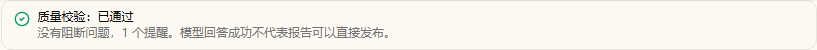
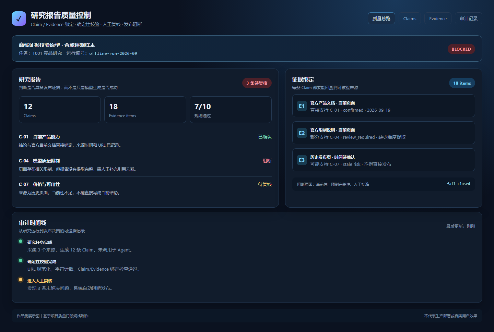

# AI 研究报告质量控制 Agent

> 面向 AI 研究报告发布前的质量控制工具：将检索过程、结论、证据和人工判断绑定到同一版本，避免“程序运行成功”被误认为“报告可以发布”。



## 项目背景

通用研究 Agent 可以搜索网页并生成报告，但测试中发现：**运行成功不代表事实正确、来源有效或结论可以直接发布**。常见风险包括引用与结论脱节、历史信息冒充当前事实，以及质量不达标时仍可继续发布。

本项目为研究流程增加独立的质量控制层，让失败可识别、可阻断、可复核、可追溯。

**完整流程：** 提交研究任务 → Agent 搜索并阅读页面 → 保存 Claim / Evidence 与运行事件 → 确定性校验 → 阻断或进入人工复核 → 确认、退回或拒绝

## 产品方案

- **事实分层**：将搜索次数、页面访问、Token、延迟等系统记录，与模型提交的结论分开保存，避免模型自证。
- **证据绑定**：报告正文、Claim、Evidence、引用关系和报告版本一并保存，支持从结论回溯来源。
- **确定性校验**：使用程序检查字符数、工具次数、必填维度、域名、引用绑定和时间语义，不把全部判断交给模型。
- **发布阻断**：命中硬规则时关闭发布能力，返回具体失败项和整改建议。
- **人工复核**：复核决定绑定报告版本，支持确认、退回和拒绝；报告修改后必须重新校验。
- **审计回放**：保存研究运行、校验结果和人工动作，便于复盘报告为何通过或被阻断。

## 验证结果

项目先使用固定样例进行零费用回归，再以真实 API 完成研究任务复测：

| 验证项 | 结果 |
|---|---|
| 研究运行 | 完成搜索、页面读取和报告生成 |
| 结构化提交 | 生成 4 个 Claim、2 个 Evidence，并保存引用关系 |
| 模型调用 | 8 次，共 78,602 tokens |
| 单次任务成本 | 约 ¥0.1676 |
| 质量控制结果 | 运行成功，但因质量规则未通过而阻断发布 |

这一结果体现了项目目标：**不以“生成成功”为终点，而是在证据不足时阻止低可信报告进入发布流程。**

## 个人贡献

- 从研究报告可信度问题出发，定义 MVP 范围、用户流程、质量门禁和人工复核状态机。
- 设计 Claim / Evidence 数据契约，以及“系统事实—模型候选—确定性校验—人工决定”的分层机制。
- 将引用绑定、信息时效、工具使用、报告结构等要求转化为可执行校验规则。
- 设计阻断原因、整改建议和复核界面，完成前端—Gateway—SQLite 联合验收。
- 建立固定样例回归与真实 API 复测，记录 Token、成本、校验结果和产品边界。

## 快速开始

本项目保留 DeerFlow 的运行方式：

```bash
make setup
make docker-start
```

启动后访问 `http://localhost:2026`。模型和搜索服务需要通过本地 `.env` 配置；请勿将密钥提交到仓库。

## 关键文档

- [AI 产品经理项目案例](./docs/product/AI_PM_PORTFOLIO_CASE_STUDY.md)
- [产品需求文档](./docs/product/PRODUCT_REQUIREMENTS_DOCUMENT.md)
- [研究质量门禁](./docs/product/RESEARCH_QUALITY_GATES.md)
- [证据校验器规格](./docs/product/EVIDENCE_VALIDATOR_SPEC.md)
- [阶段三联合验收](./docs/product/evidence-validator-results/STAGE3_REVIEW_JOINT_ACCEPTANCE.md)
- [真实账号界面验收](./docs/product/evidence-validator-results/P0_1_REAL_ACCOUNT_UI_ACCEPTANCE.md)

## 当前边界

- 当前为个人本地 MVP，没有企业生产部署或真实企业用户数据。
- 现有结果证明流程能够发现并阻断风险，不代表报告事实准确率达到 100%。
- 未完成大规模未知样本上的误报率、漏报率和跨模型稳定性验证。
- 搜索源的可访问性、时效性和内容质量仍会影响研究结果。

## 开源基础

本项目基于 [DeerFlow 2.0](https://github.com/bytedance/deer-flow) 开展产品化扩展，复用了其研究运行框架、工具链和基础界面；本仓库新增的工作集中在证据结构、确定性校验、人工复核、发布门禁与验收材料。上游说明见 [README_DEERFLOW_UPSTREAM.md](./README_DEERFLOW_UPSTREAM.md)。

## License

遵循仓库中的开源许可文件与上游项目许可要求。


## 产品界面预览



> 作品集展示图：离线证据校验原型，使用合成评测样本，不代表生产部署或真实用户效果。
