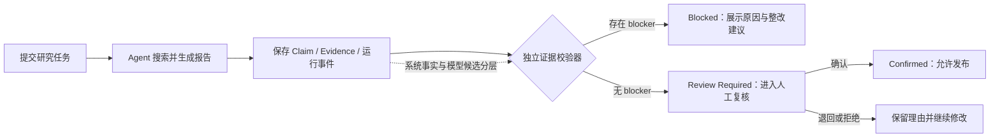

# 证据优先产品情报 Agent

> 基于 DeerFlow 2.0 二次设计的 AI 产品经理求职项目：让研究报告不止“生成成功”，还要经过证据校验与人工复核，才能进入发布流程。

[](#当前状态与边界)
[](#产品方案)
[](#真实数据与验证结果)
[](./README_DEERFLOW_UPSTREAM.md)


## 项目概览

通用研究 Agent 可以联网、搜索并生成报告，但真实测试暴露出一个关键问题：**程序运行成功，不代表报告可以放心发布。**

本项目把研究流程拆成四层：

1. **系统事实**：记录实际搜索、页面访问、Token、延迟和工具调用；
2. **Agent 候选**：模型提交结论、证据和引用关系，但不能自行宣称“已确认”；
3. **确定性校验**：检查字符数、工具次数、域名、引用绑定、必填维度和时间语义；
4. **人工决定**：对无阻断问题的报告执行确认、退回或拒绝，且决定与报告版本绑定。

一句话总结：这是一个面向 AI 产品经理和小型产品团队的**研究报告发布前质量闸门**，不是“自动判真机器”。

## 为什么做这个产品

真实评测表明，继续叠加提示词不能稳定解决质量问题：

| 评测版本 | 加权分 | 估算成本 | 关键发现 |
|---|---:|---:|---|
| T001 v1 | 67 | 约 0.0927 元 | 使用官方来源，但把历史信息写成当前事实 |
| T001 v2 | 79 | 约 0.072 元 | 分数提高、成本下降，但仍引入无来源前提 |
| T001 v3 | 36 | 约 0.1041 元 | 已读取限制信息，却错误写成“未披露” |
| B1.1 真实复测 | 运行成功 | 约 0.1676 元 | 78,602 tokens、8 次模型调用，但最终被质量规则阻断 |

**产品判断：** Prompt 可以改善单次输出，却不能充当稳定的发布保证。因此，可计算的问题交给确定性规则，不可靠的语义判断保留给人工。

## 产品方案



### 核心能力

- **结构化证据提交**：报告正文与 Claim、Evidence、引用关系一并保存；
- **独立质量校验**：不使用第二个大模型评分，避免新增幻觉、延迟与成本；
- **影子模式接入**：先观察真实运行，不因校验失败改写主回答；
- **失败关闭**：证据缺失、校验异常或存在 blocker 时不能自动确认；
- **用户可见反馈**：聊天页显示状态、规则编号、问题原因和整改建议；
- **版本化人工复核**：确认、退回、拒绝均绑定 `report_hash`，报告变化后旧批准失效；
- **可点击来源**：正文“来源 N”可跳转到对应网页，并使用安全的新窗口属性。

## 目标用户与核心场景

### 目标用户假设

- 需要快速完成竞品、能力、价格和可用性研究的 AI 产品经理；
- 没有专门研究团队，但不能直接相信模型输出的小型产品团队。

### 核心场景

用户提交研究问题后，系统完成检索与报告生成，同时保留证据和运行记录；独立校验器判断报告应被阻断还是进入人工复核，最终由人做发布决定。

> 当前目标用户仍是产品假设，尚未进行真实企业用户访谈，不能把它表述成已验证需求。

## 真实数据与验证结果

| 能力 | 状态 | 验证证据 |
|---|---|---|
| DeerFlow + DeepSeek 基础回答闭环 | 已验证 | 真实 API 运行成功并记录 Token 与底层调用 |
| 结构化 Claim / Evidence | 已验证 | 真实复测生成 4 个 Claim、2 个 Evidence |
| 运行事件持久化 | 已验证 | 跨 Gateway 进程读取 6 个事件、1 个 run、1 个 validation |
| 自动影子校验与权限隔离 | 已验证 | 普通登录用户可触发，跨用户访问被隔离 |
| 阻断原因与整改建议展示 | 已验证 | 浏览器回归覆盖状态、规则编号和建议 |
| 人工确认、退回和拒绝 | 已验证 | 真实前端—Gateway—SQLite 联合验收，重启后决定仍存在 |
| 实际账号读取质量卡 | 已验证 | 真实 T001 v3 页面显示质量状态与复核控件 |

最近一次核心回归：

- 前端单元测试：**37 个文件、345 项通过**；
- 浏览器回归：**Chromium 14 项通过**；
- 人工复核相关后端专项：**127 项通过，另含 20 个子测试**；
- 联合验收：真实前端、真实 Gateway、独立 SQLite，**0 次新增模型调用、0 元新增 API 费用**。

> 以上是专项验证结果，不代表整个上游 DeerFlow 测试集全绿，也不代表生产稳定性已经验证。

## 三分钟评审路径

如果你是招聘方或项目评审者，建议按以下顺序查看：

1. [AI 产品经理案例：问题、数据、决策与面试表达](./docs/product/AI_PM_PORTFOLIO_CASE_STUDY.md)
2. [统一 PRD：用户、流程、状态机、指标和优先级](./docs/product/PRODUCT_REQUIREMENTS_DOCUMENT.md)
3. [阶段三联合验收：真实前端—Gateway—SQLite](./docs/product/evidence-validator-results/STAGE3_REVIEW_JOINT_ACCEPTANCE.md)
4. [实际账号界面验收](./docs/product/evidence-validator-results/P0_1_REAL_ACCOUNT_UI_ACCEPTANCE.md)
5. [研究质量规则](./docs/product/RESEARCH_QUALITY_GATES.md)
6. [证据校验器规格](./docs/product/EVIDENCE_VALIDATOR_SPEC.md)

演示时重点讲清三件事：

- 为什么 `success` 只是程序完成，不等于质量通过；
- 为什么没有继续无限优化 Prompt，而是引入独立确定性校验；
- 为什么最终发布权仍保留给人。

## 我的工作与开源边界

### 本项目中的个人工作

- 定义产品机会、目标用户假设、JTBD、MVP 和非目标；
- 设计合成评测集、五维评分与质量门禁；
- 根据真实 Badcase 决定从 Prompt 优化转向确定性校验；
- 设计并实现 Claim / Evidence 契约、影子校验、状态机和人工复核；
- 将后台风险转成用户可见的阻断原因与整改建议；
- 建立回归测试、验收记录和真实性边界。

### 复用的开源基础

本项目基于字节跳动开源的 [DeerFlow 2.0](https://github.com/bytedance/deer-flow) 进行二次设计与实现。Agent 运行框架、基础聊天界面、工具与沙箱等能力来自上游项目；我没有把它们表述成个人从零开发。

- [查看保留的 DeerFlow 原版说明](./README_DEERFLOW_UPSTREAM.md)
- 基线版本：`v2.0.0 / 7e7f0410797693cf882594555ba414e0361d4c6f`
- 本仓库继续遵循原项目的 [MIT License](./LICENSE)

## 当前状态与边界

当前状态：**可本地演示的求职作品集 MVP**。

已经做到：基础运行闭环、真实 API 取样、证据校验、风险展示、人工复核、持久化和专项回归。

尚未做到：

- 未验证真实企业用户价值或节省时间；
- 未验证未知样本的误报率、漏报率；
- 未实现独立审核角色、多人会签或企业审批看板；
- 未进行生产部署与线上流量验证；
- 新规则完成后，尚未再次运行新的付费模型样本。

因此，本项目不宣称“已上线”“准确率 100%”或“已被真实企业采用”。

## 本地运行

本项目保留 DeerFlow 原有运行方式。首次使用请先阅读：

- [DeerFlow 原版安装与配置说明](./README_DEERFLOW_UPSTREAM.md#quick-start)
- [项目安装脚本](./Install.md)

最短流程：

```bash
make setup
make docker-start
```

然后访问 `http://localhost:2026`。

密钥只应保存在 Git 忽略的 `.env` 中；`config.yaml` 和 `frontend/.env` 也不应提交。请勿把真实 API Key 写入源码、Issue、截图或日志。

## 目录索引

```text
docs/product/                 产品机会、PRD、质量规则与案例材料
docs/product/evidence-validator-results/
                              真实/合成验收记录与可追溯证据
backend/                      Gateway、运行事件、校验与人工复核
frontend/                     聊天页质量状态与复核交互
scripts/evidence_validator.py 离线确定性证据校验器
tests/product/                产品规则与固定样本回归
```

## License 与致谢

本项目基于 DeerFlow 开源项目继续开发，遵循 [MIT License](./LICENSE)。感谢 DeerFlow、LangGraph、LangChain 及其开源社区。
