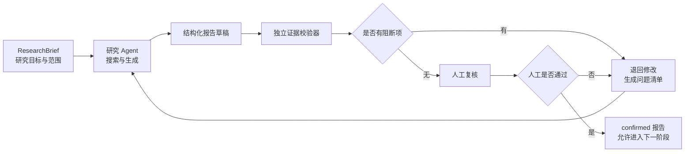

# 独立证据校验器产品规格

版本：v1.0
更新时间：2026-09-19
阶段：产品设计完成，尚未实现
适用范围：Product Intelligence Agent 的联网研究结果、竞品比较和决策材料

## 1. 产品问题

T001 v1 至 v3 证明：把质量规则写进提示词，不能保证模型真正执行。

- v1 把历史发布信息写成当前事实，并遗漏同页限制。
- v2 改善了时效标注，却引入没有来源的“Pro $200 暂停注册”前提。
- v3 已打开官方发布页的 limitations 段，仍错误声称页面没有披露模型质量限制；页面可见正文 877 个总字符，却自报约 560。

因此，研究 Agent 不能同时担任“内容生成者”和“最终裁判”。需要在生成结果与人工发布之间增加一个独立、可审计、优先使用确定性规则的证据校验器。

## 2. 目标与非目标

### 目标

1. 在报告交给人工复核前，自动拦截已知的证据、结构和范围错误。
2. 将“为什么不能发布”转换成可定位、可修改的校验结果。
3. 让字符数、来源数量、状态和发布判断由系统计算，不依赖模型自报。
4. 保留人工最终决定，并记录覆盖、驳回和例外原因。

### 非目标

- 不承诺判断互联网事实绝对真实。
- 不替代领域专家或最终发布责任人。
- 首版不新增第二个模型充当裁判，避免再次引入模型错误和额外费用。
- 不自动修改原报告、不自动对外发布。
- 不把三条合成样本的通过结果包装成真实用户或生产效果。

## 3. 产品定位

**一句话定义：** 证据校验器是位于研究 Agent 与人工发布之间的独立质量闸门，用确定性规则检查“结论是否有证据、证据是否支持结论、是否覆盖必填维度、是否满足范围约束”。

核心用户：

- 生成研究报告的 AI 产品经理或产品运营；
- 复核竞品、市场与立项材料的产品负责人；
- 维护 Agent 质量规则与 Badcase 的质量运营人员。

核心价值：不是让报告“看起来更完整”，而是阻止证据不足或自检失真的报告直接进入决策。

## 4. 工作流

产品原则：**先校验，后人工确认；未确认，不发布。**

## 5. 核心数据对象

| 对象 | 作用 | 关键内容 |
|---|---|---|
| ResearchBrief | 规定任务边界 | 研究问题、必填维度、允许来源、搜索/页面/字符上限、时间范围 |
| Claim | 报告中的可核验陈述 | 陈述文本、类型、当前/历史时间属性、对应证据编号 |
| EvidenceItem | 保存支持或反驳陈述的证据 | URL、规范化 URL、页面标题、发布时间、访问时间、原文摘录、证据状态 |
| ValidationFinding | 单条校验结果 | 规则编号、严重级别、关联 Claim/Evidence、问题说明、建议动作 |
| ResearchReport | 待发布研究结果 | 正文、来源、统计信息、校验状态、人工复核状态 |

### 最小输入契约

校验器不从自由文本中猜测全部结构。研究 Agent 必须同时输出报告正文和以下结构化字段：

| 对象 | 首版必填字段 |
|---|---|
| ResearchBrief | task_id、required_dimensions、allowed_domains、time_scope、max_searches、max_pages、max_chars、forbidden_tools |
| Claim | claim_id、text、claim_type、dimension、evidence_ids |
| EvidenceItem | evidence_id、source_url、canonical_url、title、published_at、accessed_at、excerpt、status |
| ResearchReport | report_id、rendered_text、claims、observed_searches、observed_pages、used_tools、token_usage、latency |
| ValidationFinding | finding_id、rule_id、severity、claim_id、evidence_ids、message、required_action、resolved |

独立性要求：字符数来自最终展示文本，搜索和页面数来自运行日志，URL 来自真实访问记录，证据支持关系来自 Claim—Evidence 绑定；不得采用模型在正文中自报的数字。

### 校验执行顺序

1. 规范化 URL 并合并重复来源。
2. 读取 ResearchBrief，计算字符、搜索、页面和工具等硬约束。
3. 逐条核对 Claim 是否绑定 EvidenceItem，以及时间和状态是否匹配。
4. 对否定性结论执行证据摘录反查，对必填维度执行覆盖检查。
5. 汇总 ValidationFinding，计算发布状态。
6. 只有无阻断项时才进入人工复核；人工确认后才可标记 confirmed。

### 证据状态

- `pending`：已收集但未完成支持关系核对。
- `confirmed`：人工或规则已确认可支持对应结论。
- `conflict`：不同证据互相冲突，必须并列展示。
- `stale`：时间过旧，不能单独支持当前状态。

状态规则：只有 `confirmed` 证据可以支持对外结论；`conflict`、`stale` 和没有证据的 Claim 必须进入复核。

## 6. 首版校验规则

| 编号 | 校验项 | 系统判断 | 失败级别 | 用户看到的动作 |
|---|---|---|---|---|
| EV-01 | 当前性 | 当前结论是否只依赖历史发布页；历史内容是否标时 | 阻断 | 改成历史事实或补当前来源 |
| EV-02 | 结论—证据绑定 | 每条关键 Claim 是否绑定可访问 EvidenceItem | 阻断 | 补来源或删除结论 |
| EV-03 | 否定性结论反查 | 出现“没有、未披露、无法确认”等词时，证据摘录中是否存在反例 | 阻断 | 展示冲突原文，禁止写成未知 |
| EV-04 | 必填维度覆盖 | ResearchBrief 要求的能力、范围、操作限制、模型质量限制、使用规则和时间是否齐全 | 阻断 | 标出缺失维度 |
| EV-05 | 引用直接性 | 链接是否直接支持对应 Claim；“同上、见帮助页”是否能定位到具体证据 | 阻断/警告 | 绑定具体 EvidenceItem |
| EV-06 | 字符与范围 | 由系统统计最终可见字符、搜索次数、页面次数和工具使用 | 阻断 | 显示实际值与上限 |
| EV-07 | URL 规范化 | 去除锚点、跟踪参数并处理重定向后统计唯一页面 | 警告 | 合并重复来源 |
| EV-08 | 待复核项前提 | 问题中是否暗含“暂停、取消、涨价、下线”等无证据事件 | 阻断 | 改成中性问题或补直接来源 |
| EV-09 | 冲突与过期 | `conflict`、`stale` 是否被错误写成确定事实 | 阻断 | 并列冲突或标记历史状态 |
| EV-10 | 审计完整性 | 模型、Prompt 版本、访问时间、Token、费用、延迟和复核结论是否齐全 | 警告 | 补齐运行记录 |

### 为什么首版不用第二个模型评分

第二个模型可能重复产生幻觉，还会增加成本和延迟。首版先处理可以确定计算的问题：字符数、来源数、必填字段、状态、URL、显式否定词和证据摘录反例。无法确定的语义问题交给人工，而不是伪装成自动正确。

## 7. 严重级别与发布闸门

### 严重级别

- **阻断**：关键事实无证据、结论与证据冲突、必填维度缺失、超出硬性范围、待复核项含无依据前提。
- **警告**：来源重复、审计字段不全、一般事实引用定位不够精确。
- **提示**：不影响正确性的表达与格式建议。

### 发布状态

| 状态 | 条件 | 后续动作 |
|---|---|---|
| blocked | 存在任一未解决阻断项 | 退回修改，不进入 T002 或发布 |
| review_required | 无阻断项，但有警告或尚未人工确认 | 进入人工复核队列 |
| confirmed | 无阻断项，人工复核通过 | 允许进入下一阶段，但不等于生产发布 |
| rejected | 人工判定不可修复或风险过高 | 保留 Badcase，停止扩展 |

闸门逻辑：**自动校验只能阻止明显错误，不能替代人工批准。**

## 8. 人工复核界面

首版只需要一个“问题清单 + 证据对照”页面，不做复杂后台。

页面从左到右展示：

1. **报告陈述**：高亮触发问题的 Claim。
2. **证据原文**：展示支持或反驳它的摘录、来源和时间。
3. **校验结果**：规则编号、级别、失败原因和建议动作。
4. **人工决定**：确认、退回修改、标记冲突或驳回，并填写理由。

人工不能直接把阻断项改成“通过”；必须先修改 Claim、EvidenceItem 或记录带理由的例外审批。

## 9. T001 v1—v3 离线验收矩阵

本阶段只复用已有输出，不调用模型。

| 样本 | 期望拦截 | 对应规则 | 期望状态 |
|---|---|---|---|
| T001 v1 | 历史模型冒充当前；遗漏质量限制；“没有量化指标”与 26.6% 反例冲突；超长 | EV-01、EV-03、EV-04、EV-06 | blocked |
| T001 v2 | 遗漏模型质量限制；“Pro $200 暂停注册”无来源前提 | EV-04、EV-08 | blocked |
| T001 v3 | 已读 limitations 却写“未披露”；877 字符却自报 560；重复页面统计 | EV-03、EV-06、EV-07 | blocked |

验收标准：三条已知 Badcase 全部被正确阻断；不得把任何一条误判为可发布。

## 10. MVP 指标

以下是设计目标，不是已达成结果：

| 指标 | 首版目标 | 说明 |
|---|---|---|
| 已知阻断问题召回率 | 100% | T001 v1—v3 已登记阻断项全部命中 |
| 错误放行数 | 0 | 已知 Badcase 不得进入 confirmed |
| 确定性规则 API 成本 | 0 元 | 不调用额外模型 |
| 校验结果可定位率 | 100% | 每个问题能定位 Claim、证据和规则 |
| 人工覆盖率 | 100% | 发布前必须有人工决定 |
| 人工例外理由完整率 | 100% | 任何例外都需记录责任人与理由 |

真实准确率、误报率和节省时间需要更多样本及真实用户任务后再确定，当前不得虚构。

## 11. MVP 边界与异常处理

- 页面抓取失败：EvidenceItem 保持 `pending`，报告进入 `review_required`。
- 来源内容冲突：状态设为 `conflict`，不自动选择一方。
- 来源过期：状态设为 `stale`，不能单独支持当前事实。
- 无法自动判断语义支持关系：生成警告并交人工，不调用第二个模型强行裁决。
- 人工修改报告后：只重新校验受影响 Claim，不重复执行整次联网研究。
- 服务异常或校验器不可用：默认 fail-closed，报告不能绕过闸门。

## 12. 分阶段实施

### 阶段 A：离线确定性原型

- 输入 T001 v1—v3 已有报告、来源和规则。
- 实现字符计数、URL 规范化、必填维度、否定词和证据摘录反查。
- 产出结构化 ValidationFinding 和发布状态。
- 不联网、不调用模型、不改 DeerFlow 原生成链。

### 阶段 B：接入 DeerFlow 报告出口

- 研究 Agent 完成后先进入校验器。
- 有阻断项时不展示“可发布”，而是展示问题清单。
- 人工修改后局部重检。

### 阶段 C：扩大样本与真实用户验证

- 原型能稳定拦截 T001 v1—v3 后，再决定是否付费运行新样本。
- 之后才扩展 T002—T005，并访谈 3—5 名目标用户。

## 13. 本设计的验收标准

设计评审通过需同时满足：

1. 每条 T001 已知 Badcase 都能映射到明确规则。
2. 每条规则都有输入、判断、严重级别和用户动作。
3. 发布状态和人工权限边界明确。
4. 首版不依赖新增模型调用。
5. 未实现部分、真实性边界和下一阶段授权要求均写清。

## 14. 30 分钟讲解与验收提纲

1. **5 分钟：问题**——展示 v1—v3 三次真实 API 回归，说明提示词为什么不是质量保证。
2. **5 分钟：用户与场景**——研究报告为什么需要证据、时间和人工责任。
3. **8 分钟：方案**——讲解 ResearchBrief、Claim、EvidenceItem、ValidationFinding 和发布状态。
4. **5 分钟：Badcase 演示**——用 v3 展示“已读 limitations 却写未披露”和“877 字符自报 560”。
5. **4 分钟：取舍**——为什么首版不用第二个模型评分，为什么 fail-closed。
6. **3 分钟：边界与下一步**——当前只有合成样本与本地真实 API，不代表生产稳定性；下一步先做离线原型。

面试表达重点：个人贡献是定义质量问题、设计证据状态与发布闸门、建立评测与 Badcase 闭环；DeerFlow 的搜索和生成能力来自开源项目，不能冒充个人开发。
