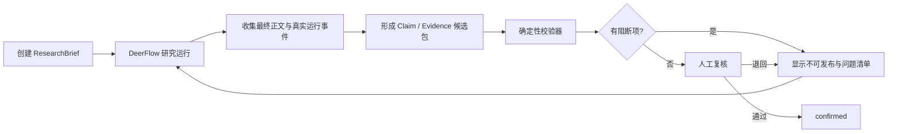

# 阶段 B 接入评审：证据校验与人工复核

版本：v1.1
更新时间：2026-09-19
评审结论：**B1 本地影子链路已通过；仍不进入全量硬门禁**

## 1. 本次评审回答什么

阶段 A 已证明：离线确定性规则能够拦截 T001 v1—v3 的已知 Badcase。阶段 B 需要回答三个产品问题：

1. DeerFlow 在哪里提供校验所需的真实运行数据？
2. 用户在哪里看见阻断原因并完成人工复核？
3. 当前证据是否足以把校验器变成所有任务的强制门禁？

本次只做产品与接入评审，不修改 DeerFlow 前后端，不调用模型。

## 2. 源码核对后的现状

| 已有能力 | 可复用内容 | 产品意义 | 目前缺口 |
|---|---|---|---|
| ThreadState | messages、artifacts 等线程状态 | 可在运行结束后取得最终正文和产物 | 没有证据校验状态 |
| Run API | run_id、thread_id、Token、调用次数、metadata | 可形成一次研究任务的审计主键和成本记录 | 没有验证结果与报告版本绑定 |
| 运行事件 | AI、Tool 等消息事件 | 可核对真实工具行为，而不是相信模型自报 | 尚未转换为搜索数、页面数和证据清单 |
| 引用组件 | 当前能展示引用链接和域名 | 可复用链接打开体验 | 只能“展示链接”，不能说明链接是否支持结论 |
| onFinish | 前端可感知运行完成与最终 state | 可在完成后拉取校验结果 | 尚无校验请求和状态展示 |
| Feedback API | 点赞/点踩和可选评论 | 适合满意度反馈 | 不支持批准、退回、冲突、报告哈希和复核责任记录 |

核对入口：

- `backend/packages/harness/deerflow/agents/thread_state.py`
- `backend/app/gateway/routers/thread_runs.py`
- `backend/packages/harness/deerflow/runtime/journal.py`
- `backend/app/gateway/routers/feedback.py`
- `frontend/src/core/threads/types.ts`
- `frontend/src/core/threads/hooks.ts`
- `frontend/src/components/workspace/citations/citation-link.tsx`

## 3. 产品决策

### 3.1 不把普通聊天全部变成研究任务

证据校验只在用户选择“证据研究”质量配置时启用。普通问答继续沿用现有流程，避免增加理解成本和无意义阻断。

### 3.2 不让模型自报运行事实

| 数据 | 权威来源 |
|---|---|
| 最终字符数 | 最终展示正文，由系统计算 |
| 搜索、页面、工具使用 | 运行事件和 ToolMessage |
| Token、模型调用数 | Run 记录 |
| URL 是否真实访问 | 工具事件中的真实 URL |
| Claim 与 Evidence 关系 | Agent 提交候选结构，校验器检查 |
| 最终批准 | 登录用户的人工决定 |

模型可以提出 Claim 和 Evidence 候选，但不能决定自己是否合格，也不能覆盖系统运行记录。

### 3.3 不复用点赞/点踩作为审批

满意度和发布责任不是一回事。需要独立的 ValidationRecord 与 ReviewDecision，避免“点了赞”被误解成已核验事实。

### 3.4 不隐藏失败报告

报告仍可查看，但明确标为“不可发布”。用户必须能看到具体阻断项、证据原文和修改动作；不能只显示一个失败分数。

## 4. 推荐工作流



关键边界：校验失败不删除回答、不自动重跑模型、不自动产生费用。

## 5. 最小数据契约

### 5.1 ValidationRecord

| 字段 | 来源 | 作用 |
|---|---|---|
| validation_id | 系统 | 校验记录唯一编号 |
| schema_version | 系统 | 防止后续字段升级混淆 |
| thread_id / run_id / message_id | DeerFlow | 定位一次回答 |
| report_hash | 系统 | 保证人工批准对应的是未被修改的版本 |
| brief | 用户与质量配置 | 任务范围、允许来源和上限 |
| claims | Agent 候选结构 | 待核验陈述及证据绑定 |
| evidence | Agent 候选 + 工具事件核对 | URL、摘录、访问时间和状态 |
| observed_metrics | 系统 | 字符、搜索、页面、工具、Token、延迟 |
| findings | 校验器 | 规则、级别、定位和修正动作 |
| auto_status | 校验器 | blocked 或 review_required |
| created_at | 系统 | 审计时间 |

### 5.2 ReviewDecision

| 字段 | 规则 |
|---|---|
| validation_id | 必须指向当前报告版本 |
| decision | approved、returned、rejected |
| reviewer_user_id | 来自登录身份，不由前端自报 |
| reason | returned、rejected 必填；例外审批首版不开放 |
| report_hash | 与 ValidationRecord 一致，否则决定失效 |
| created_at | 系统生成 |

人工决定采用追加记录，不覆盖历史。报告正文、Claim 或 Evidence 变化后，旧批准自动失效，状态回到 `review_required`。

## 6. 推荐接口边界

阶段 B 不把产品专属字段直接塞进通用点赞接口。建议单独提供：

- `GET /api/threads/{thread_id}/runs/{run_id}/evidence-validation`
- `POST /api/threads/{thread_id}/runs/{run_id}/evidence-validation/reviews`

运行创建时只在 metadata 中保存质量配置标识，例如 `quality_profile_id=evidence-research-v1`；完整校验记录由服务端持久化，避免前端决定审计事实。

## 7. 复核界面设计

### 7.1 回答下方状态卡

```text
┌──────────────────────────────────────────────┐
│ 证据校验：不可发布          2 阻断 · 2 警告 │
│ 正文 877 / 800 字符 · 页面 4 次 / 2 个唯一页 │
│ [查看问题与证据]                              │
└──────────────────────────────────────────────┘
```

状态颜色不是唯一信息，必须同时显示文字和数量：

- 红色：`blocked`，不可确认。
- 黄色：`review_required`，等待人工处理。
- 绿色：`confirmed`，显示复核人和时间。
- 灰色：`validator_error`，按 fail-closed 处理，不得假装通过。

### 7.2 问题与证据抽屉

从左到右展示：

1. **报告陈述**：高亮问题 Claim。
2. **证据原文**：来源、摘录、访问时间和状态。
3. **校验发现**：规则编号、严重级别、原因、修改动作。
4. **人工动作**：确认、退回、驳回。

交互约束：

- 有 blocker 时不显示“确认通过”。
- 退回和驳回必须填写理由。
- 引用点击继续打开原始页面，但“链接可打开”不等于“支持结论”。
- 人工不能直接覆盖 blocker；首版必须先修改报告或证据并重新校验。

## 8. 异常与权限

| 场景 | 期望行为 |
|---|---|
| 校验服务异常 | `validator_error`，不可发布 |
| 页面抓取结果缺失 | Evidence 为 pending，进入人工复核或阻断 |
| 报告修改 | report_hash 变化，旧批准失效 |
| 重复提交审批 | 使用幂等键，避免生成多条相同决定 |
| 非线程所有者 | 不可读取或提交审批 |
| 浏览器刷新 | 从服务端恢复校验和人工决定 |
| 同一线程多次研究 | 每个 run/message 独立记录，不使用“线程最新结果”覆盖历史 |

## 9. 分阶段方案

### B0：契约与回放接入，推荐现在做

- 将阶段 A 校验器整理为可被后端调用的纯函数模块。
- 用 T001 v1—v3 和无阻断对照样本回放，不调用模型。
- 建立 ValidationRecord / ReviewDecision 的接口模型和权限测试。
- 制作静态状态卡与抽屉，数据来自固定夹具。
- 不改真实回答流程，不对所有聊天启用。

### B1：研究模式影子运行

- 只对指定的“证据研究”配置生成校验记录。
- 用户可以看到结果，但暂不据此自动重跑或发布。
- 收集误报、漏报、复核耗时和退回原因。

### B2：有限硬门禁

- 只有在扩充离线样本并完成误报评审后，才对研究模式启用“不可发布”。
- 普通聊天不受影响。
- 任何新的付费模型回归仍需单独授权。

## 10. 验收矩阵

| 编号 | 场景 | 期望结果 |
|---|---|---|
| B-01 | T001 v1 回放 | blocked，命中 EV-01/03/04/06 |
| B-02 | T001 v2 回放 | blocked，命中 EV-04/08 |
| B-03 | T001 v3 回放 | blocked，系统字符 877、唯一页 2 |
| B-04 | 无阻断对照样本 | review_required，不能自动 confirmed |
| B-05 | 人工批准对照样本 | confirmed，记录用户与时间 |
| B-06 | 批准后修改报告 | 旧批准失效，重新校验 |
| B-07 | 校验器异常 | validator_error，fail-closed |
| B-08 | 越权复核其他线程 | 拒绝并不产生决定记录 |
| B-09 | 重复 URL 与锚点 | 保留页面查看次数，合并唯一来源 |
| B-10 | 刷新页面 | 校验结果和人工决定保持一致 |

## 11. 指标

阶段 B 首先观测，不虚构目标效果：

- 已知 blocker 检出率。
- 对照样本误阻断率。
- 人工平均复核时长。
- 退回原因分布。
- 自动判断与人工判断分歧率。
- 报告修改后旧批准失效率。
- 校验器错误率。
- 确定性校验新增模型成本：应保持 0 元。

## 12. Go / No-Go 结论

### Go

进入 **B0 契约与回放接入**。理由：现有系统已经具备 run、message、工具事件、Token、引用展示和用户身份基础；阶段 A 也有可回归的离线原型。

### 暂不 Go

不进入全量前后端硬门禁，不运行 T002，不新增付费样本。原因：

1. 当前只有三份已知负样本和一份程序内对照样本。
2. Claim / Evidence 尚未从真实 DeerFlow 运行自动形成。
3. 尚未测量误报率、复核耗时和真实用户价值。
4. 现有反馈接口不满足人工审批的责任和版本绑定要求。

### B0 结束后的决策条件

- B-01 至 B-10 全部通过。
- 至少形成 5 个无阻断或边界对照样本，验证不会只会“拦截”。
- 每个批准均绑定 report_hash、复核人和时间。
- 后端异常时不能绕过门禁。
- 产品负责人确认界面文案不会把 `confirmed` 误解为“事实绝对真实”。

## 13. AI 产品经理面试表达

可表述为：

> 我没有继续堆提示词，而是把生成、确定性校验和人工责任拆成三层。先用三次真实 API Badcase 定义规则，再用离线原型验证已知问题，随后核对开源系统现有数据链路，决定先做契约回放和影子模式，而不是直接对全部聊天上线硬门禁。

个人贡献边界：产品问题定义、质量状态机、输入契约、接入方案、风险门禁和验收设计；DeerFlow 的基础 Agent、运行和引用能力来自开源项目。

## 14. 30 分钟学习与验收

1. 5 分钟：区分满意度反馈与发布审批。
2. 5 分钟：区分模型候选数据、系统观测数据和人工决定。
3. 7 分钟：讲清 ValidationRecord、ReviewDecision 和 report_hash。
4. 5 分钟：看状态卡和证据抽屉如何降低复核成本。
5. 5 分钟：用 B-01 至 B-10 解释验收不是“页面能打开”。
6. 3 分钟：说明为什么当前只 Go 到 B0。


## 15. B0 实际验收（2026-09-19）

### 已完成

- 建立可执行的 ValidationRecord / ReviewDecision 契约，覆盖报告哈希、所有者权限、人工决定、幂等和 fail-closed。
- 完成 8 份固定样本回放：3 份已知负样本全部 blocked；5 份正向/边界样本全部 review_required；固定样本内错误放行 0、错误阻断 0。
- 完成四状态静态复核界面：不可发布、待人工复核、已确认、校验异常。桌面浏览器已逐态核对。
- 产品测试共 31 项通过；本阶段模型调用 0 次，新增 API 费用 0 元。

### B-01 至 B-10 核对

| 场景 | B0 结果 | 边界 |
|---|---|---|
| B-01 至 B-04 | 通过 | 仅固定合成夹具回放 |
| B-05 至 B-09 | 通过 | 仅本地内存契约和单元测试 |
| B-10 | 未完成真实链路验证 | 静态页面会重载固定数据，但尚无服务端数据库持久化，不能证明用户提交决定后刷新仍保持一致 |

### 当前 No-Go

暂不进入真实 DeerFlow 回答链路、B1 影子运行或全量硬门禁。还需先确定服务端持久化方案、把真实 run/message/tool 事件映射成输入契约，并验证窄屏浏览器表现。任何新的模型回归仍需单独授权。

真实性边界：B0 是本地离线实现和静态原型，不是已上线功能，也没有证明未知样本准确率、生产稳定性或真实用户价值。
## 16. B1 影子运行实际验收（2026-09-19）

### 已完成

- 确定性校验核心、灰度配置、`0003_evidence_validations` 迁移、幂等仓储、真实 run/event 采集、后台调度、GET 查询和 POST 重放已接入。
- 功能默认关闭；本机验收只允许一个脱敏测试账号和 `evidence-research-v1`，真实账号 ID 未进入 Git。
- 对既有 T001 v3 成功 run 连续重放两次，HTTP 200 且返回相同 validation_id；Token 49,456、模型调用数 5 前后不变，验收窗口内新增 `chat/completions` 日志为 0。
- 重启 Gateway 后仍能 GET 到相同 validation_id 和 report_hash；不存在的 run 返回 404。
- B1 专项 35 项、持久化边界 49 项、产品层 31 项通过；B0 的 8 个样本继续保持零不一致。

详细证据见 [`evidence-validator-results/B1_SHADOW_ACCEPTANCE.md`](evidence-validator-results/B1_SHADOW_ACCEPTANCE.md)。

### 产品解释

本次证明的是“旁路校验链路、权限、幂等和持久化可用”，不是“模型回答已经事实正确”。旧 T001 事件使用 memory backend，Gateway 重启后无法恢复，所以真实重放只能可靠取得最终正文、Token 和模型调用数；搜索、页面和工具显示为 0 的同时附带数据缺口，不能把 0 当成原任务没有使用工具。

普通回答仍无稳定 Claim/Evidence 结构，因此语义状态为 `not_evaluable`。这正是影子模式的价值：先暴露数据缺口和误报风险，不影响主回答，也不提前上线硬门禁。

### 当前 No-Go

仍不进入 B2 全量硬门禁。下一阶段先评审是否把 run events 改为可持久化，并让研究质量配置原生输出结构化 Claim/Evidence；随后用新的、明确授权的样本测量误报率和人工复核效率。未经新授权不运行 T002 或新的付费回归。
